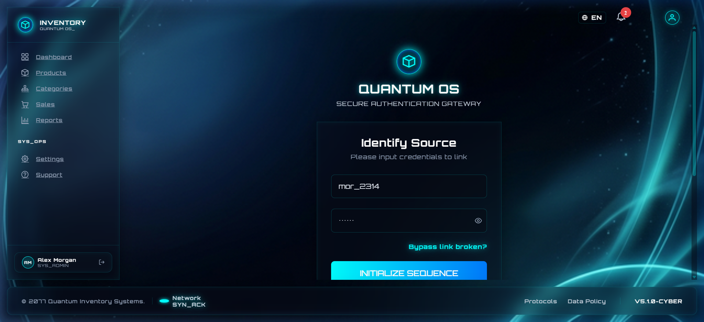
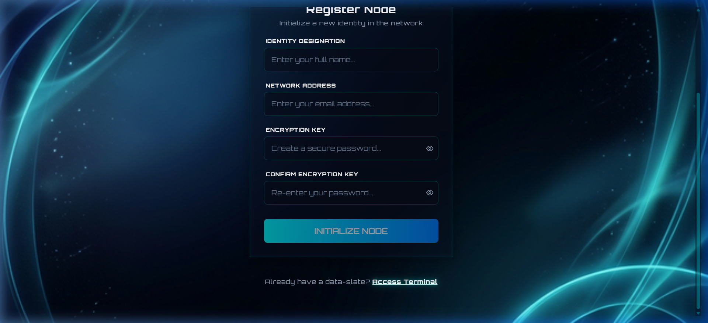
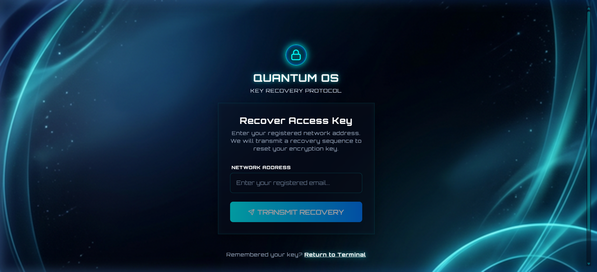
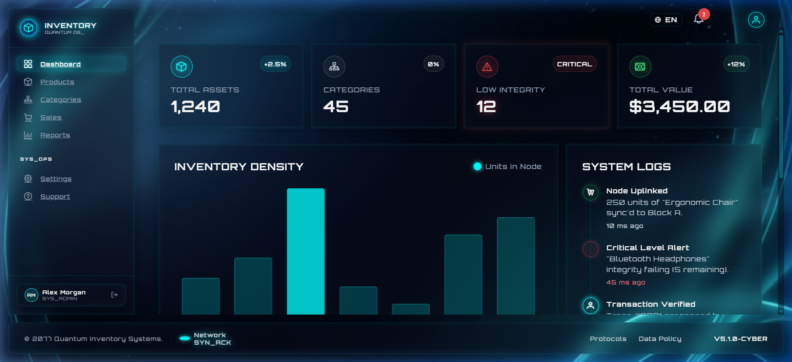
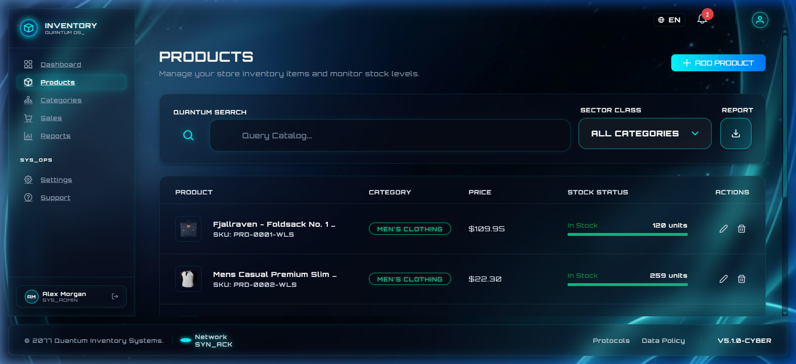
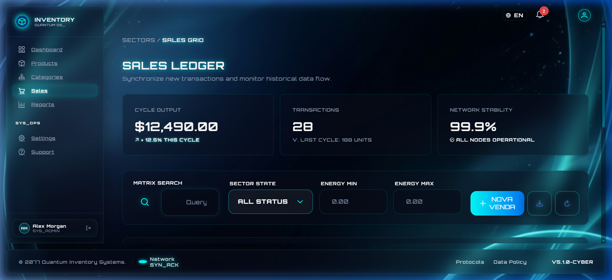
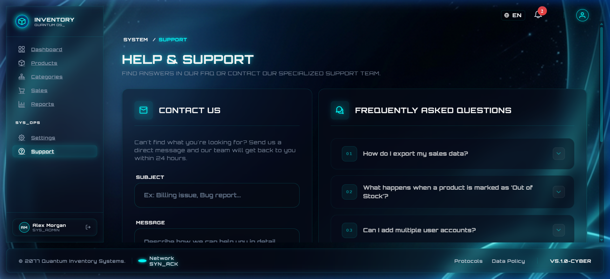

<div align="center">

# ⚡ StockFlow Pro — Quantum Inventory System

### An enterprise-grade inventory management system built with Angular 19, featuring a unique Sci-Fi Glassmorphism design theme.


</div>

---

## 📸 Screenshots

<div align="center">

### 🔐 Authentication Gateway (Login/Register/Forgot)

<br>

<br>


### 📊 Dashboard — Real-Time KPIs


### 📦 Products — Inventory Management


### 💰 Sales — Transaction Ledger


### 🛠️ Support — Futuristic FAQ Accordion


</div>

---

## 🚀 Features

| Feature | Description |
|---|---|
| **Dashboard** | Real-time KPIs, Chart.js graphs (bar, doughnut), system logs |
| **Products** | Full CRUD, search, category filters, stock progress bars |
| **Categories** | Category management with metrics and data table |
| **Sales** | Transaction ledger with new sale form and historical data |
| **Reports** | Historical analytics with temporal filters and charts |
| **Settings** | Profile, preferences, security tabs (2FA, password) |
| **Support** | Contact form + custom futuristic FAQ accordion |
| **Auth** | JWT mock authentication with route guards |

---

## 🏗️ Architecture

The project follows **Clean Architecture** principles with clear separation of concerns:

```
src/app/
├── core/           # Guards, Interceptors (JWT)
├── data/           # Services (API communication layer)
├── domain/         # Models & Interfaces
├── state/          # Facades with Angular Signals (State Management)
└── features/       # Standalone Components (8 feature modules)
    ├── auth/
    ├── dashboard/
    ├── products/
    ├── categories/
    ├── sales/
    ├── reports/
    ├── settings/
    └── support/
```

### Key Architectural Decisions

- **Standalone Components** — No NgModules, Angular 19 modern approach
- **Angular Signals** — Reactive state management via Facade pattern
- **Functional Guards & Interceptors** — Modern Angular patterns for auth
- **Lazy Loading** — All routes are lazily loaded for performance
- **Custom Theme Preset** — PrimeNG Aura base with custom Indigo palette

---

## 🎨 Design System — Sci-Fi Glassmorphism

A fully custom **"Quantum OS"** design theme featuring:

- 🌌 **Deep space background** with animated particles
- 💎 **Glassmorphism panels** with `backdrop-filter: blur()` and translucent borders
- ⚡ **Neon accent colors** (Cyan `#00f3ff`, Blue `#0066ff`, Magenta)
- 🔤 **Custom typography** with Inter + monospace for data
- 📜 **Styled scrollbars** matching the cyber theme
- 🏷️ **Neon tags** with glow effects for categories
- 🎵 **Futuristic accordion** with energy-line animations

---

## 🧪 Testing

The project includes **36 unit tests** using Jest with Angular's native builder:

```bash
npm test
```

| Test Suite | Tests |
|---|---|
| `auth.guard.spec.ts` | Route protection logic |
| `jwt.interceptor.spec.ts` | Token injection |
| `auth-data.service.spec.ts` | Auth API calls |
| `product-data.service.spec.ts` | Product API calls |
| `auth-facade.service.spec.ts` | Auth state management |
| `product-facade.service.spec.ts` | Product state management |
| `app.component.spec.ts` | Root component |

---

## 🌐 Internationalization (i18n)

Full bilingual support with **instant language switching**:

- 🇺🇸 English
- 🇧🇷 Português

Powered by `@ngx-translate/core` with JSON translation files in `/public/i18n/`.

---

## ⚙️ Tech Stack

| Technology | Purpose |
|---|---|
| **Angular 19** | Framework (Standalone, Signals, Control Flow) |
| **PrimeNG 19** | UI Component Library |
| **PrimeFlex 4** | Utility CSS Framework |
| **Chart.js 4** | Data visualization |
| **@ngx-translate** | Internationalization |
| **Jest 29** | Unit testing |
| **TypeScript 5.7** | Type safety |
| **Vercel** | Deployment platform |

---

## 🏃 Getting Started

### Prerequisites

- Node.js 18+
- npm 9+

### Installation

```bash
# Clone the repository
git clone https://github.com/uchoacarlos22/inventory-control.git

# Navigate to the project
cd inventory-control

# Install dependencies
npm install

# Start development server
ng serve
```

Open `http://localhost:4200` in your browser.

### Login Credentials (Mock)

```
Username: any value
Password: any value
```

> The app uses a mock JWT auth system — any credentials will work.

### Build for Production

```bash
ng build
```

Output is generated in `dist/inventory-control/`.

---

## 📁 Project Structure

```
inventory-control/
├── public/
│   └── i18n/              # Translation files (en.json, pt.json)
├── src/
│   ├── app/
│   │   ├── core/          # Guards & Interceptors
│   │   ├── data/          # API Services
│   │   ├── domain/        # Models
│   │   ├── state/         # Facades (Signals)
│   │   └── features/      # 8 Feature Components
│   ├── styles.css          # Global styles (Sci-Fi theme)
│   └── index.html
├── docs/screenshots/       # README screenshots
├── vercel.json             # Vercel SPA config
├── angular.json
├── package.json
└── tsconfig.json
```

---

## 👨‍💻 Author

**Carlos Uchoa**

- GitHub: [@uchoacarlos22](https://github.com/uchoacarlos22)

---

## 📄 License

This project is for portfolio and educational purposes.
